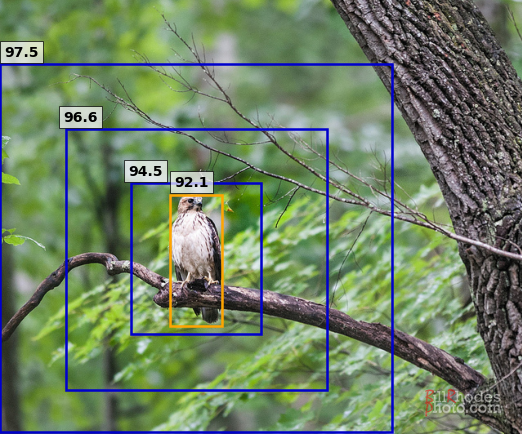

# CLIP Contextual Analysis
Experimentation on CLIP's classification behaviour by changing prompts and contextual information

This repo explores the CLIP accuracy, when the context of image and input prompt changes.

# Usage
Simple start running the cells of the notebook to get started.

This notebook can be used to produce visualizations.

Sample output:

  

# Acknoledgements
This repo is a modified version of this [open-source collab](https://colab.research.google.com/github/openai/clip/blob/master/notebooks/Interacting_with_CLIP.ipynb#scrollTo=bYaEHUWrtqCS) 
